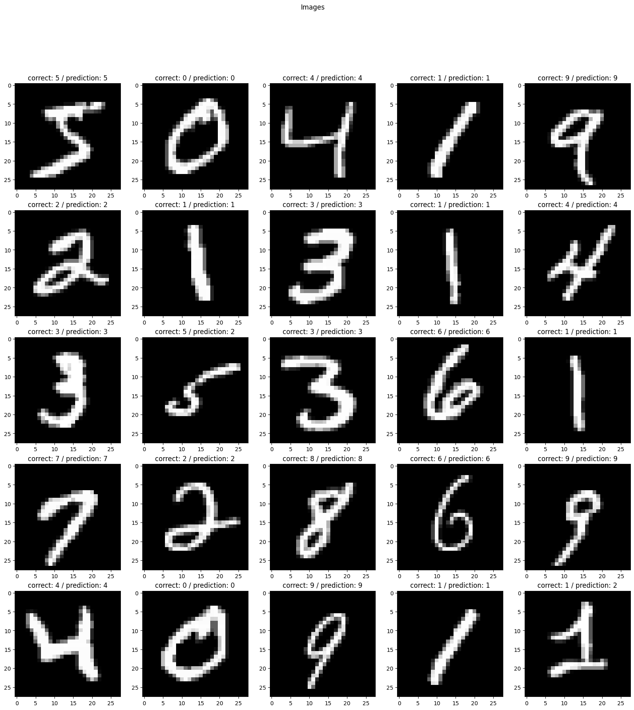

# neural network from scratch
- **no machine learning libraries at all** (tensorflow/pytorch/sklearn...)
- numpy/matplotlib/other utility libraries are used
- data ([source](https://www.kaggle.com/datasets/hojjatk/mnist-dataset)) is manually downloaded and placed in `data/`

### docs
- `src/main.py` - training file
- `src/main_notrain.py` - prediction file using saved parameters from the training file
- `parameters/` - where parameters are saved
- all the other files - neural network architecture, math functions, utility stuff

### setup
- `pip install -r requirements.txt`
- `pip freeze >> requirements.txt`